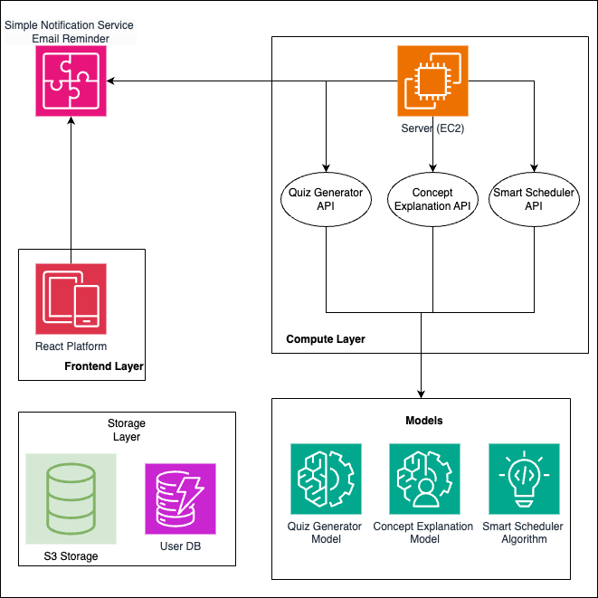

# StudyMate – Your AI-Powered Study Assistant

StudyMate is an AI-driven study companion built to help students reduce decision fatigue and learn with clarity. It generates flashcards from class materials, and recommends daily tasks based on focus and energy levels. The system blends a clean UI with a custom scheduling engine and a locally managed RAG pipeline.

---

## 1. Why This Project Exists
Students often spend more time deciding what to study than studying. Deadlines, scattered notes, and unclear priorities create unnecessary friction.

StudyMate solves this by:
- Turning PDFs or notes into structured flashcards   
- Keeping everything in one clean dashboard  

The goal is a study system that feels supportive, predictable, and actually useful.

## 2. High-Level Architecture Diagram

A high-level system overview is shown below:



This diagram represents the core flow between the frontend, backend compute layer, vector store, and model components.

---

## 3. Dataset

This project uses the **LearningQ Dataset** (Chen et al., 2018) as the foundation for educational question generation and flashcard construction.

LearningQ contains over **230,000 document–question pairs** sourced from:
- **TED-Ed** (instructor‑generated questions covering multiple cognitive levels)
- **Khan Academy** (learner‑generated questions reflecting genuine learning gaps)

Key reasons for choosing LearningQ:
- Covers all six levels of **Bloom’s Revised Taxonomy**.
- Allows generation of higher-order reasoning questions.
- Contains longer, semantically rich documents suitable for RAG.
- More diverse than traditional datasets such as SQuAD or RACE.

This dataset forms the backbone of StudyMate’s ability to create context-aware quizzes, flashcards, and concept explanations.

---

## 4. Model Training Methodology

The educational question-generation model was trained using **microsoft/phi-3-mini-4k-instruct** with supervised fine-tuning and LoRA.

### 4.1 Base Model

- Model: Phi-3 Mini 4K Instruct  
- Chosen for efficiency, strong instruction-following, and suitability for educational tasks.

### 4.2 Prompt Format

Each LearningQ sample is transformed into a prompt–answer pair:

```
You are an educational question generator.
Write ONE clear, student-friendly question based only on the passage.

Passage:
{input}

Question:
```

### 4.3 Tokenization Strategy

- Minimum 40 percent of token window reserved for answer.  
- Long passages trimmed from the left while preserving context.  
- Output aligned with supervised training mask (`labels != -100`).  

### 4.4 LoRA Training

LoRA Configuration:
- r = 16  
- alpha = 32  
- dropout = 0.05  
- Applied to q_proj, k_proj, v_proj, o_proj  

Optimizer:
- AdamW (or paged AdamW when quantized)

### 4.5 Training Arguments

- Batch size: 1  
- Gradient accumulation: 2  
- Learning rate: 2e-4  
- Logging steps: 10  
- Training: 1 epoch  

Adapters saved to:

```
outputs/phi3-learningq/lora/
```

---

## Project Breakdown

StudyMate contains four major layers:

### **1. Frontend (Next.js + Tailwind)**
- Flashcard Generator
- Query Answering from notes
- File upload  
- Dashboard  

### **2. Backend (Python)**
- Custom RAG pipeline  
- Task engine and scheduler  
- Local embeddings + ChromaDB  
- Training and ingestion scripts  
- Model loading and retrieval  

### **3. Vector Storage & Models**
- ChromaDB stores all embeddings  
- `outputs/` contains trained models and artifacts  
- LearningQ dataset processed into embeddings  

### **4. AI Layer**
- GPT‑4 Turbo / Claude for text generation 
- Microsoft phi-3-mini-4k-instruct
- Local model fragments for retrieval  
- Prompt templates and chain logic  
- LangGraph for streamlined flow

---

## Folder Structure (Detailed)

```
StudyMate/
│
├── backend/
│   ├── configs/
│   ├── data/                     # LearningQ JSONL files
│   ├── docs/
│   ├── graph/
│   ├── models/
│   ├── prompts/
│   ├── retrievers/
│   ├── scripts/
│   │   ├── train.py
│   │   ├── ingest.py
│   │   └── run_server.py
│   ├── services/
│   ├── src/
│   ├── utils/
│   ├── outputs/                  # Trained models + vectors
│   ├── venv/
│   └── requirements.txt
│
├── data/
├── frontend/
├── outputs/
└── README.md
```

---

## Backend Setup

### **1. Move into backend**
```
cd backend
```

### **2. Create virtual environment**
```
python3 -m venv venv
source venv/bin/activate
```

### **3. Install dependencies**
```
pip install -r requirements.txt
```

### **4. Train the model**
This prepares embeddings, processes the dataset, and writes model artifacts to `outputs/`.

```
python -m backend.scripts.train
```

### **5. Ingest embeddings into ChromaDB**
```
python -m backend.scripts.ingest
```

### **6. Start the backend server**
```
python -m backend.scripts.run_server
```

---

## Frontend Setup

### **1. Install dependencies**
```
cd frontend
npm install
```

### **2. Run development server**
```
npm run dev
```

Then open:  
```
http://localhost:5173
```

---


## Acknowledgements

This project was completed as part of the Master of Science degree at the Rochester Institute of Technology.

Special thanks to:
- **Nick Snyder** — Project Committee Chair  
- **Zhiqiang Tao** — Project Committee Co-Chair  
- The LearningQ dataset authors  
- The open‑source community supporting ChromaDB, Sentence‑Transformers, and the Hugging Face ecosystem  

---

## References

Boateng, G., John, S., Glago, A., Boateng, S., & Kumbol, V. (2022). *Kwame for science: An AI teaching assistant based on Sentence-BERT*. International Conference on Intelligent Technologies and Applications (ITBA).

Boyce, P. (2019). *Schools are outdated. It’s time for reform*. The Epoch Times.

Chen, G., Yang, J., Hauff, C., & Houben, G.-J. (2018). *LearningQ: A large‑scale dataset for educational question generation*. Proceedings of the Twelfth International AAAI Conference on Web and Social Media.

Chen, Y., Jensen, S., Albert, L. J., Gupta, S., & Lee, T. (2023). Artificial intelligence (AI) student assistants in the classroom: Designing chatbots to support student success. *Information Systems Frontiers, 25*, 161–182.

Lai, G., et al. (2017). *RACE: Large-scale reading comprehension dataset*. arXiv:1704.04683.

Reimers, N., & Gurevych, I. (2023). *Sentence‑Transformers Library*.

Sumanth, N. S., et al. (2024). AI‑enhanced learning assistant platform. *International Conference on Inventive Computation Technologies*.

Verma, M. (2024). A study on relationship between fatigue and decision-making among college students. *International Journal of Interdisciplinary Approaches in Psychology*.

---

## Project Citation

```
@software{Srinivasan_StudyMate_2025,
  author = {Srinivasan, Swetha},
  title = {StudyMate: An AI-Powered Study Assistant to Fight Decision Fatigue},
  year = {2025},
  institution = {Rochester Institute of Technology},
  url = {https://github.com/swetha2507/StudyMate}
}
```
